# DVWA Brute Force Attack Lab

## Overview

This lab documents a **brute-force authentication exercise** performed against **Damn Vulnerable Web Application (DVWA)** in a controlled local environment.

The purpose of the exercise was to understand how weak authentication mechanisms can be targeted using automated credential guessing and how **Burp Suite Intruder** can be used to test combinations of usernames and passwords.

All testing was performed against DVWA, an intentionally vulnerable web application running locally for cybersecurity training.

---

## Objectives

The objectives of this lab were to:

* Configure a local DVWA testing environment.
* Set DVWA to the **Low** security level.
* Route browser traffic through Burp Suite.
* Intercept an authentication request.
* Send the captured request to Burp Suite Intruder.
* Configure username and password payload positions.
* Perform automated credential testing.
* Analyse server responses to distinguish failed and successful authentication attempts.
* Understand security controls that can mitigate brute-force attacks.

---

## Lab Environment

| Component  | Purpose                                                             |
| ---------- | ------------------------------------------------------------------- |
| DVWA       | Intentionally vulnerable web application used as the testing target |
| XAMPP      | Provides the local Apache web server and MySQL database             |
| Burp Suite | Used to intercept, inspect, and automate HTTP requests              |
| Firefox    | Browser used to access DVWA                                         |
| Windows    | Host operating system                                               |
| Localhost  | Local isolated testing environment                                  |

**DVWA Security Level:** Low

> **Scope:** All testing in this lab was performed against my own local DVWA environment for educational purposes.

---

# Testing Procedure

## 1. Start the DVWA Environment

The first step was to start the services required for the DVWA environment.

XAMPP was used to run the **Apache web server** and **MySQL database** required by DVWA.


With the required services running, DVWA could be accessed through the local web server.

---

## 2. Access DVWA

DVWA was accessed through the local web server using Firefox.

The DVWA login page provided access to the intentionally vulnerable application used throughout the lab.

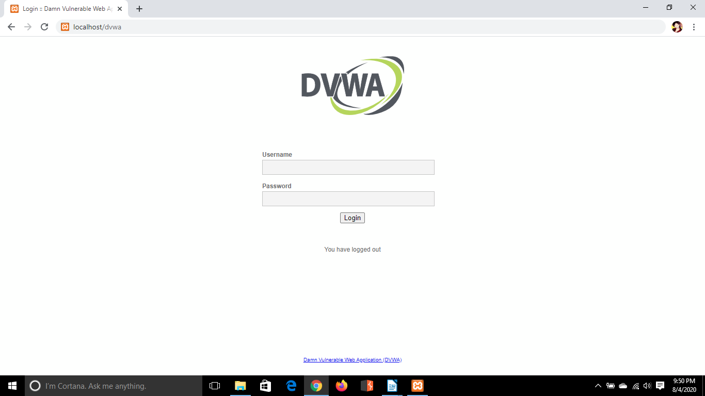

After logging in, the application's security configuration could be changed for the exercise.

---

## 3. Configure the DVWA Security Level

The DVWA security level was configured to **Low** before performing the brute-force exercise.

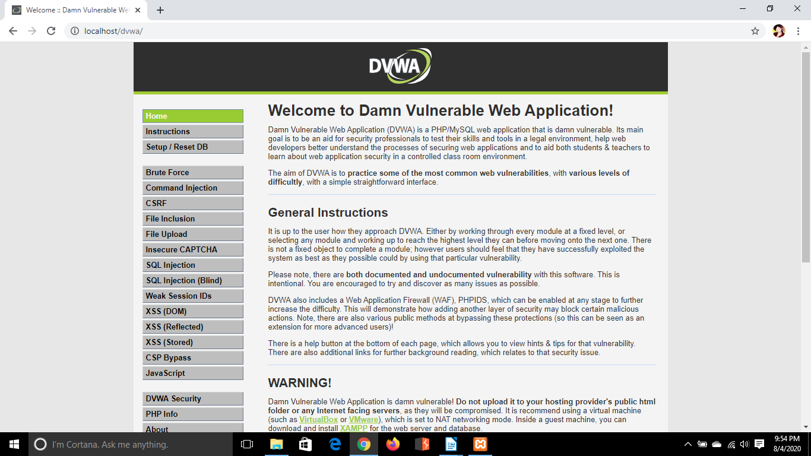

DVWA intentionally provides different security levels for learning purposes. The Low setting provides minimal protection, making it possible to observe how vulnerable authentication mechanisms behave.

---

## 4. Configure the Browser Proxy

Firefox was configured to route its web traffic through **Burp Suite**.

This allowed Burp Suite to operate as an intercepting proxy between the browser and the DVWA application.


Routing traffic through Burp Suite made it possible to inspect and manipulate HTTP requests generated while interacting with DVWA.

---

## 5. Open the DVWA Brute Force Module

The **Brute Force** vulnerability module was selected from the DVWA navigation menu.

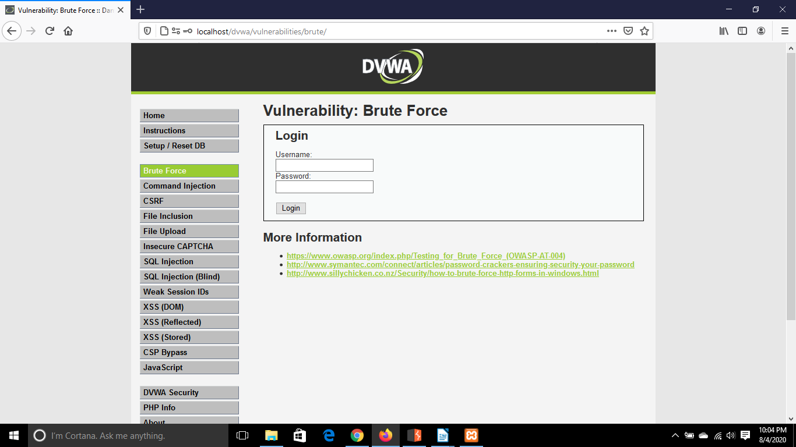

The module contains a basic username and password authentication form. This provided the authentication endpoint used for the exercise.

---

## 6. Intercept the Authentication Request

Burp Suite Proxy interception was enabled before submitting credentials through the DVWA authentication form.

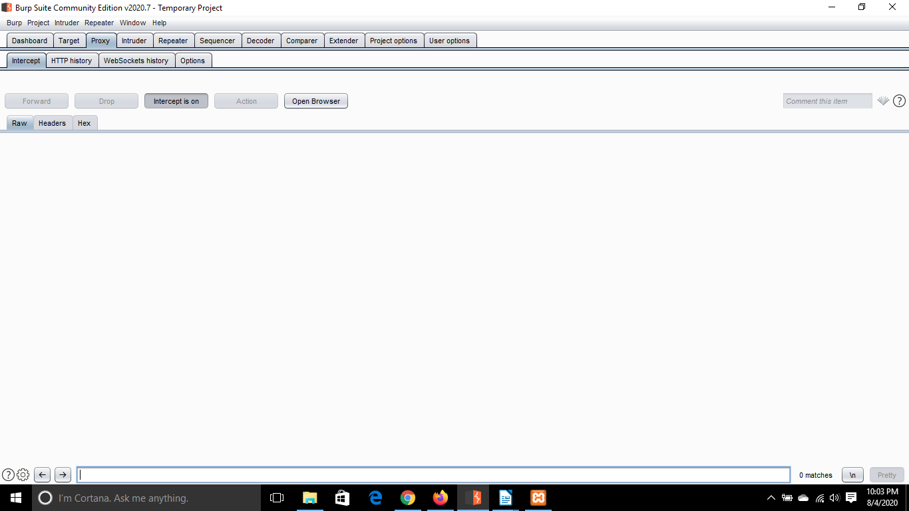

When the login attempt was submitted, Burp Suite intercepted the HTTP request before it reached the DVWA server.

Capturing the request allowed the authentication parameters to be inspected and provided a request that could be reused for automated testing.

---

## 7. Send the Request to Burp Suite Intruder

The captured authentication request was sent from **Proxy** to **Burp Suite Intruder**.

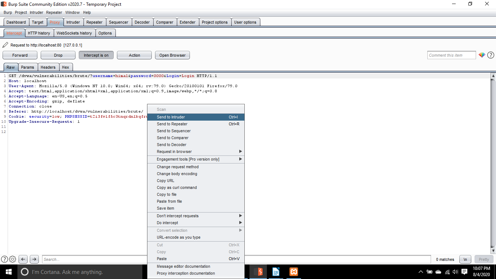

Intruder can repeatedly send modified versions of an HTTP request while replacing selected parameters with values from predefined payload lists.

This makes it useful for demonstrating automated credential testing in a controlled environment.

---

## 8. Configure the Attack Positions

Within Intruder, the username and password parameters were selected as payload positions.

A **Cluster Bomb** attack configuration was used because two independent payload sets were being tested.

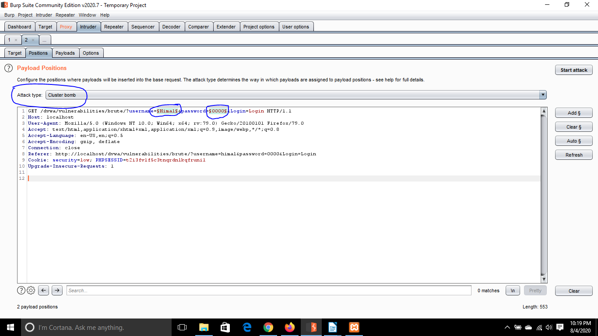

With this configuration, Burp Suite can test combinations between the username and password payload sets.

Conceptually, combinations are generated in the following way:

```text
username1 : password1
username1 : password2
username2 : password1
username2 : password2
```

This demonstrates how automation can test many credential combinations significantly faster than manually submitting each login attempt.

---

## 9. Configure the Username Payloads

A list of potential usernames was configured as the first Intruder payload set.

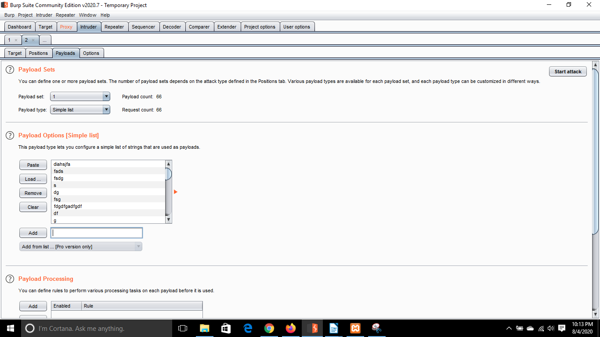

During the attack, Burp Suite substituted each username from the payload list into the selected username parameter.

---

## 10. Configure the Password Payloads

A separate list of potential passwords was configured as the second payload set.

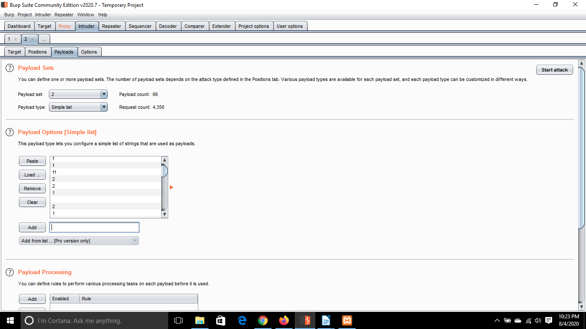

Combining the two payload sets allowed Intruder to generate multiple username and password combinations automatically.

---

## 11. Configure Response Detection

The application's failed authentication response was examined so unsuccessful login attempts could be distinguished from potentially successful attempts.

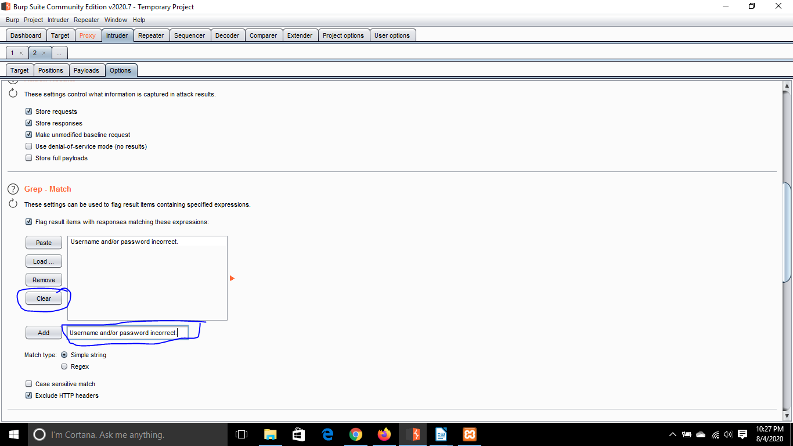

When testing an authentication mechanism, useful response characteristics can include:

* Response content
* Response length
* HTTP status codes
* Redirect behaviour
* Error messages
* Presence or absence of specific text

A response that differs from the normal failed-login response may indicate that a credential combination produced a different result.

---

## 12. Run the Brute-Force Test

The configured Intruder attack was started against the local DVWA authentication endpoint.

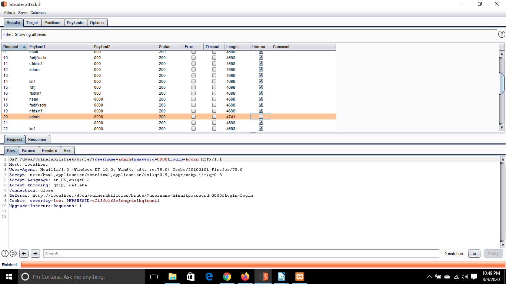

Burp Suite automatically submitted the configured credential combinations and displayed the resulting HTTP responses.

The responses were compared to identify results that differed from normal authentication failures.

---

## 13. Verify Successful Authentication

After identifying a potentially valid credential combination, the credentials were tested against DVWA to confirm the result.

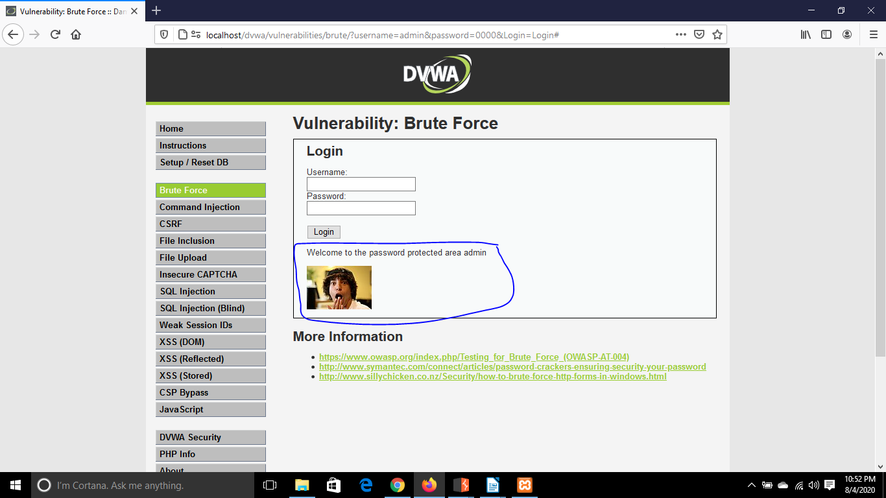

This verification step was important because an unusual response in Intruder does not by itself prove that authentication succeeded.

Confirming the credentials directly against the application verified the result of the exercise.

---

# Results

The exercise demonstrated how an authentication mechanism without sufficient protection against repeated login attempts can be exposed to automated credential guessing.

The testing process followed this workflow:

**Browser → Burp Proxy → Captured Request → Intruder → Payload Combinations → Response Analysis → Credential Verification**

Burp Suite was used to:

1. Intercept an authentication request.
2. Inspect the username and password parameters.
3. Send the request to Intruder.
4. Configure multiple payload positions.
5. Supply username and password payload lists.
6. Generate credential combinations automatically.
7. Compare application responses.
8. Identify a potentially successful authentication attempt.
9. Verify the result against DVWA.

The lab demonstrated how automation can make credential guessing significantly more efficient when an authentication endpoint lacks appropriate defensive controls.

---

# Why the Attack Worked

A brute-force or credential-guessing attack becomes more practical when an application allows repeated authentication attempts without sufficient restrictions.

Several weaknesses can contribute to this risk:

* Lack of effective rate limiting.
* Lack of progressive delays between failed attempts.
* Weak or predictable passwords.
* Lack of multi-factor authentication.
* Insufficient monitoring of repeated authentication failures.
* Authentication responses that make successful attempts distinguishable.

DVWA intentionally contains weaknesses for educational purposes, allowing these authentication concepts to be studied safely.

---

# Security Impact

If similar authentication weaknesses existed in a real application, an attacker could potentially obtain unauthorised access to user accounts.

Depending on the privileges of the compromised account, this could result in:

* Account takeover.
* Exposure of sensitive information.
* Unauthorised access to application functionality.
* Modification or deletion of data.
* Abuse of the compromised user's privileges.
* Further attacks using the compromised account.
* Credential reuse against other services.

The actual impact would depend on the application, the affected account, and the privileges associated with it.

---

# Mitigation

A secure authentication system should use multiple defensive controls rather than relying solely on passwords.

## Rate Limiting

Applications should restrict excessive authentication attempts over a defined period.

Rate limiting can significantly increase the time and resources required to perform automated credential guessing.

## Progressive Delays

Applications can introduce increasing delays after repeated failed authentication attempts.

This reduces the speed at which automated attempts can be performed while avoiding some of the problems associated with permanent account lockouts.

## Account Lockout Controls

Temporary account restrictions may be introduced after a defined number of failed authentication attempts.

Lockout mechanisms should be designed carefully because overly aggressive policies can potentially be abused to deny legitimate users access to their accounts.

## Multi-Factor Authentication

Multi-factor authentication provides an additional security layer beyond the password.

Even if a password is successfully guessed or compromised, an attacker would still need the additional authentication factor.

## Strong Password Practices

Users should be encouraged to use strong, unique passwords and avoid commonly used or previously compromised credentials.

## Monitoring and Alerting

Authentication systems should monitor behaviour such as:

* Repeated failed login attempts.
* Rapid authentication attempts.
* Attempts against multiple accounts.
* Unusual login locations or devices.
* Large numbers of failures followed by successful authentication.

These events can help security teams detect possible credential attacks.

## Secure Authentication Responses

Applications should avoid exposing unnecessary differences between authentication failure responses.

Consistent responses can make it more difficult to determine whether a particular username exists or whether a specific authentication attempt produced a meaningful difference.

---

# What I Learned

This lab helped me understand that brute-force testing involves more than simply trying multiple passwords.

Through this exercise, I gained practical experience with:

* Setting up DVWA in a local environment.
* Configuring the DVWA security level.
* Configuring a browser proxy.
* Using Burp Suite Proxy.
* Intercepting HTTP requests.
* Identifying authentication parameters.
* Sending requests to Burp Suite Intruder.
* Configuring Intruder attack positions.
* Understanding the Cluster Bomb attack type.
* Creating separate username and password payload sets.
* Comparing HTTP responses.
* Identifying potentially successful authentication attempts.
* Manually verifying testing results.

Most importantly, the exercise demonstrated the relationship between **automated testing and authentication security controls**.

Tools such as Burp Suite make it possible to automate repetitive HTTP requests, which is why production authentication systems need controls such as rate limiting, MFA, monitoring, and strong password practices.

---

# Key Takeaways

* Authentication endpoints should never rely solely on passwords for protection.
* Automated tools can rapidly test large numbers of credential combinations.
* HTTP response analysis is an important part of authentication security testing.
* Rate limiting and progressive delays can significantly reduce automated attack effectiveness.
* MFA provides an important additional layer of protection against compromised passwords.
* Authentication monitoring can help identify suspicious login behaviour.
* Results identified through automated testing should be manually verified.

---

# Ethical Use Disclaimer

This lab was performed using **Damn Vulnerable Web Application (DVWA)**, an intentionally vulnerable application designed for cybersecurity education and security testing practice.

All testing documented in this repository was conducted in a controlled local environment against a system intended for this purpose.

The techniques demonstrated in this repository should only be used against systems that you own or systems for which you have explicit authorisation to perform security testing.

---

## Navigation

[Back to Repository Home](../../README.md)
