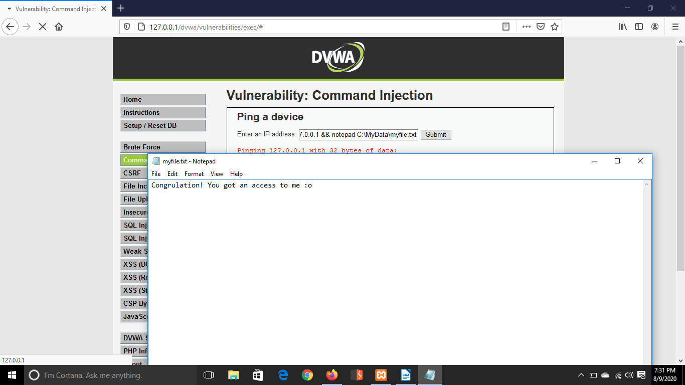
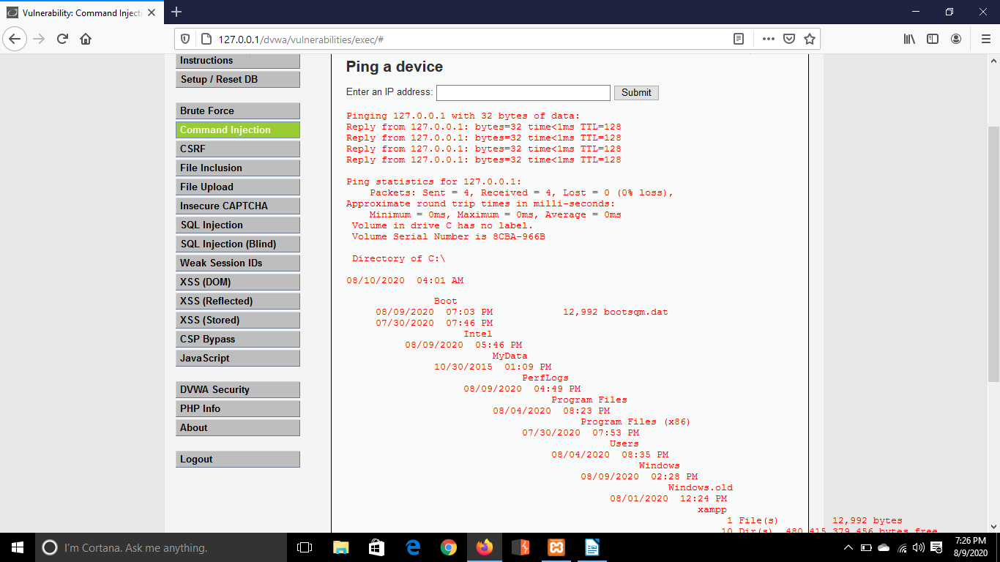
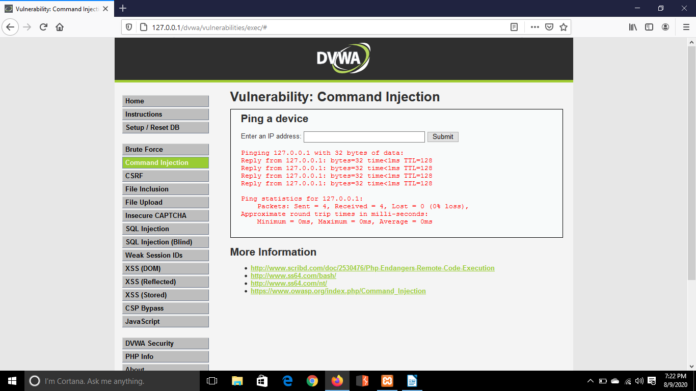
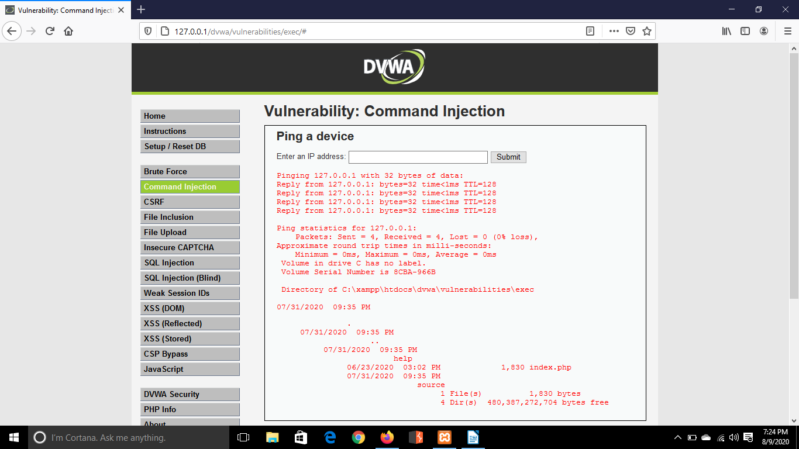

# DVWA Command Injection Lab

## Overview

This lab documents a **command injection vulnerability** in **Damn Vulnerable Web Application (DVWA)** within a controlled local environment.

The purpose of the exercise was to understand how insufficient validation of user-controlled input can allow additional operating system commands to be executed by a vulnerable web application.

The exercise began with legitimate input to observe the application's expected behaviour. Additional Windows commands were then appended using the `&&` command separator to demonstrate how vulnerable input handling could allow unintended operating system commands to execute.

All testing was performed against DVWA running locally for cybersecurity training.

---

## Objectives

The objectives of this lab were to:

* Configure a local DVWA testing environment.
* Set DVWA to the **Low** security level.
* Understand the expected behaviour of the Command Injection module.
* Test legitimate input before attempting injection.
* Understand the role of command separators such as `&&`.
* Demonstrate execution of an additional operating system command.
* Perform basic directory enumeration through the vulnerable input.
* Understand why command injection vulnerabilities occur.
* Identify security controls that can prevent command injection.

---

## Lab Environment

| Component | Purpose                                                             |
| --------- | ------------------------------------------------------------------- |
| DVWA      | Intentionally vulnerable web application used as the testing target |
| XAMPP     | Provides the local Apache web server and MySQL database             |
| Firefox   | Browser used to interact with DVWA                                  |
| Windows   | Host operating system and command environment                       |
| Localhost | Local isolated testing target                                       |

**DVWA Security Level:** Low

> **Scope:** All testing in this lab was performed against my own local DVWA environment for educational purposes.

---

# Vulnerability Background

**OS command injection** occurs when an application passes user-controlled input into an operating system command without safely validating or handling that input.

For example, an application may legitimately need to execute a command similar to:

```text
ping 127.0.0.1
```

If the application directly incorporates user input into the operating system command, an attacker may attempt to introduce shell metacharacters or command separators.

On Windows, `&&` can be used to execute a second command if the preceding command succeeds.

Conceptually:

```text
command1 && command2
```

If unsafe input is accepted by a vulnerable application, an input such as:

```text
127.0.0.1 && dir
```

could potentially cause the operating system to interpret the resulting command as:

```text
ping 127.0.0.1 && dir
```

Instead of performing only the intended ping operation, the application may therefore execute an additional operating system command.

---

# Testing Procedure

## 1. Start the DVWA Environment

The required DVWA services were started using XAMPP.

Apache provided the local web server, while MySQL provided the database service required by DVWA.


Once the services were running, the DVWA application could be accessed locally.

---

## 2. Access DVWA

The DVWA login page was opened through the local web server.


After authenticating to the application, the DVWA security settings were configured for the exercise.

---

## 3. Configure the DVWA Security Level

The DVWA security level was configured to **Low**.


DVWA intentionally provides vulnerable configurations at this security level so common web application vulnerabilities can be observed and studied safely.

---

## 4. Open the Command Injection Module

The **Command Injection** vulnerability module was selected from the DVWA navigation menu.



The page accepts an IP address and performs a ping operation.

Before attempting command injection, the normal behaviour of the application was tested.

---

## 5. Test Normal Application Behaviour

The loopback IP address was entered:

```text
127.0.0.1
```



The application performed the expected ping operation against localhost.

Establishing normal behaviour first is useful during security testing because it provides a baseline that can be compared with later responses.

---

## 6. Test Command Injection

The next input appended the Windows `dir` command using the `&&` command separator:

```text
127.0.0.1 && dir
```



The expected functionality of the application was only to perform a ping.

However, the additional `dir` command was also interpreted by the operating system.

This demonstrated that user-controlled input was influencing the command executed by the underlying system.

The `&&` operator is significant because the command shell interprets it as a command separator that executes the following command when the preceding command succeeds.

---

## 7. Enumerate the Root Directory

After confirming command execution, the test was extended by specifying a directory:

```text
127.0.0.1 && dir C:\
```



The response displayed information from the root of the `C:\` drive.

This demonstrated that the vulnerability could be used for more than simply executing an additional command. It could also expose information about the underlying operating system and filesystem.

---

## 8. Enumerate a Target Directory

The command was then modified to inspect a specific directory:

```text
127.0.0.1 && dir C:\MyData
```


The application returned the directory listing produced by the operating system.

This confirmed that the injected command was being executed in the context of the vulnerable web application.

---

# Results

The exercise successfully demonstrated command injection against the DVWA Command Injection module at the **Low** security level.

The testing progression was:

```text
Normal Input
127.0.0.1
        |
        v
Expected Ping Operation
        |
        v
Command Separator Introduced
127.0.0.1 && dir
        |
        v
Additional OS Command Executed
        |
        v
Directory Enumeration
        |
        v
C:\ and C:\MyData inspected
```

The key observation was that input intended to represent only an IP address was able to influence the operating system command executed by the application.

---

# Why the Vulnerability Exists

The vulnerability occurs because user-controlled input is handled unsafely before being passed to an operating system command.

The application expects something similar to:

```text
127.0.0.1
```

However, when shell syntax is accepted without adequate validation, the command interpreter may treat part of the input as additional instructions.

For example:

```text
127.0.0.1 && dir
```

contains two distinct components:

```text
127.0.0.1
```

The value expected by the application.

And:

```text
&& dir
```

Shell syntax instructing the operating system to execute an additional command.

The core security problem is therefore not the `dir` command itself. The problem is that **untrusted input is allowed to influence the structure of an operating system command**.

---

# Security Impact

Command injection can be a severe vulnerability because successful exploitation may allow an attacker to execute commands with the permissions of the vulnerable application.

Depending on the application's environment and privileges, potential consequences can include:

* Disclosure of files and directories.
* Exposure of system information.
* Access to sensitive application configuration.
* Modification or deletion of files.
* Execution of unauthorised programs.
* Credential or secret exposure.
* Further compromise of the host system.
* Use of the affected system to attack other resources.

The severity depends heavily on the privileges under which the vulnerable application is running.

A web application running with minimal permissions limits the potential impact, while an application running with excessive privileges can significantly increase the consequences of command injection.

---

# Mitigation

## Avoid Operating System Commands Where Possible

The strongest defence is to avoid invoking operating system commands with user-controlled input.

Applications should use appropriate programming language APIs or libraries instead of shell commands whenever possible.

For example, if an application needs networking functionality, a networking library is generally safer than constructing a command-line string and passing it to the operating system shell.

---

## Strict Input Validation

When user input is required, the application should define exactly what constitutes valid input.

For an IP address field, the application should accept only a valid IP address rather than arbitrary text or shell syntax.

Input should be validated against an allowlist of expected values or formats.

---

## Avoid Shell Interpretation

User-controlled input should not be concatenated directly into command strings.

Where operating system processes must be executed, safer APIs that pass arguments separately from the executable should be preferred over invoking a shell with a constructed command string.

---

## Apply Least Privilege

Web applications should run using accounts with only the permissions necessary to perform their intended functions.

If command execution becomes possible, least privilege can reduce the attacker's ability to access sensitive files or modify the system.

---

## Logging and Monitoring

Applications and operating systems should monitor unusual process execution and suspicious input patterns.

Potential indicators include:

* Unexpected child processes spawned by web applications.
* Shell interpreters launched by web server processes.
* Unusual command-line arguments.
* Repeated requests containing shell metacharacters.
* Unexpected filesystem access.

Monitoring does not replace secure coding, but it can help detect attempted exploitation.

---

# What I Learned

This lab helped me understand the relationship between **web application input and operating system command execution**.

Through the exercise, I gained practical experience with:

* Testing the normal behaviour of an application before attempting exploitation.
* Understanding how the DVWA Command Injection module works.
* Recognising the security significance of shell command separators.
* Understanding the behaviour of the Windows `&&` operator.
* Demonstrating additional command execution.
* Using `dir` to observe filesystem information in a controlled environment.
* Understanding how unsafe input handling leads to command injection.
* Recognising the importance of strict input validation.
* Understanding why applications should avoid constructing shell commands from user input.
* Applying the principle of least privilege when considering vulnerability impact.

One of the most important lessons from this exercise was that the security issue is not simply that an application allows the `dir` command.

The underlying issue is that **user input can change the meaning and structure of a command executed by the operating system**.

---

# Key Takeaways

* Command injection occurs when untrusted input can influence operating system commands.
* Normal application behaviour should be established before testing for vulnerabilities.
* Shell metacharacters and command separators can alter how commands are interpreted.
* Successful command injection may expose the underlying filesystem and operating system.
* Applications should avoid executing shell commands using user-controlled input.
* Strict allowlist validation can significantly reduce injection risk.
* Least privilege can reduce the impact of successful exploitation.
* Secure coding should be the primary defence, with monitoring providing an additional detection layer.

---

# Ethical Use Disclaimer

This lab was performed using **Damn Vulnerable Web Application (DVWA)**, an intentionally vulnerable application designed for cybersecurity education and security testing practice.

All testing documented in this repository was conducted in a controlled local environment against a system intended for this purpose.

The techniques demonstrated in this repository should only be used against systems that you own or systems for which you have explicit authorisation to perform security testing.

---

## Navigation

[← Previous: Brute Force](../01-brute-force/README.md) | [Back to Repository Home](../../README.md) | [Next: CSRF →](../03-csrf/README.md)
