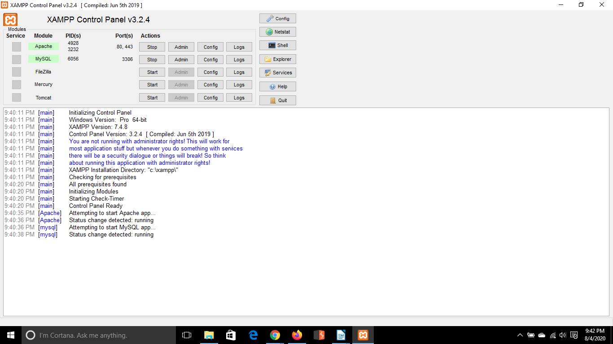
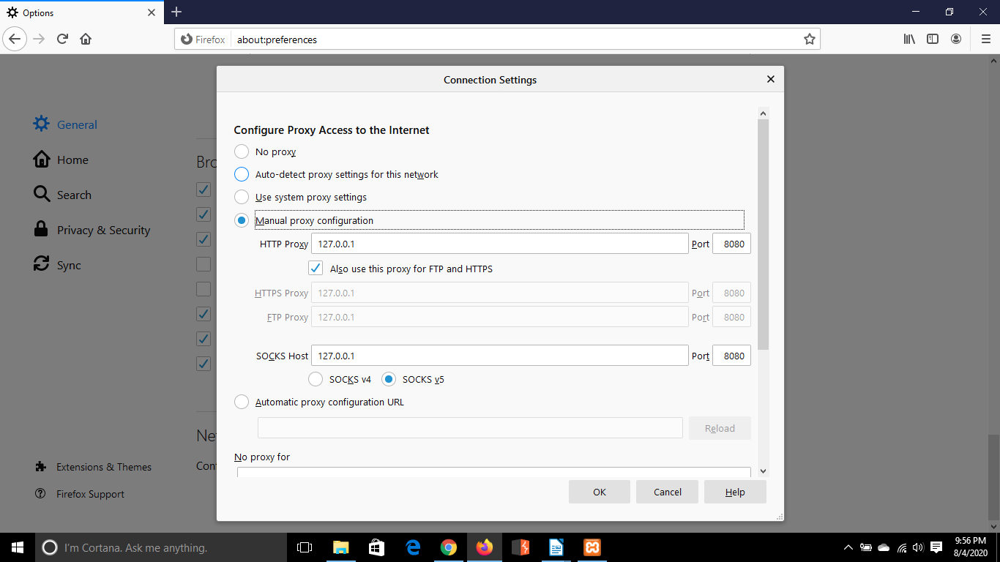
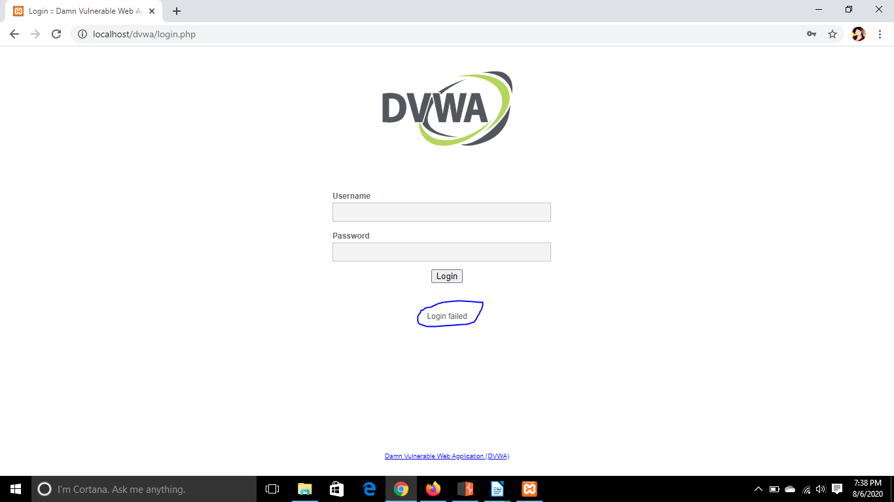
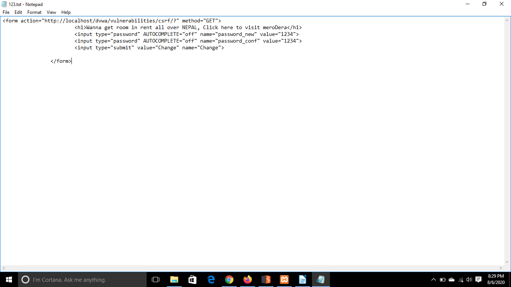
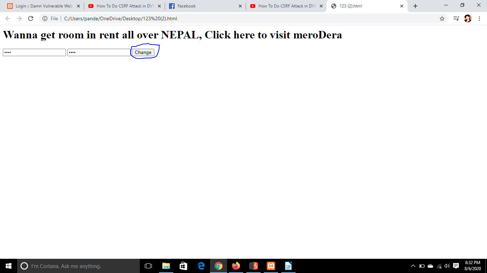
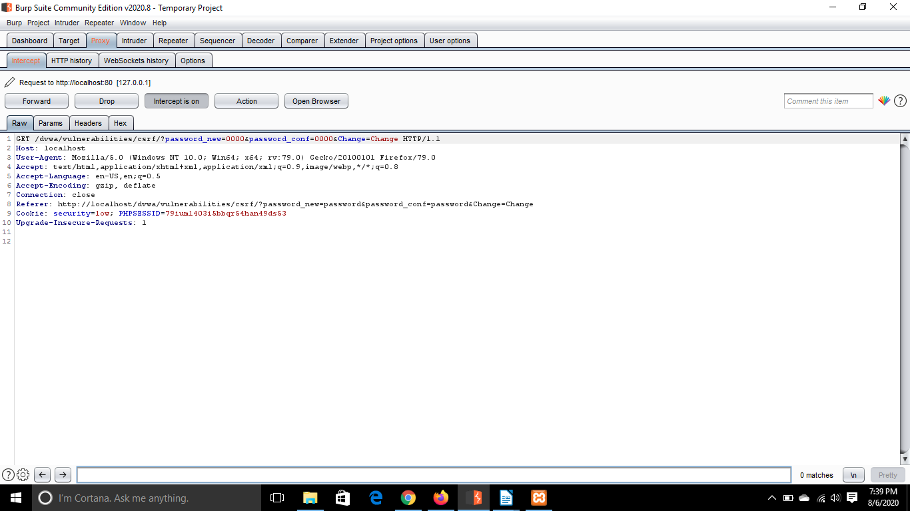
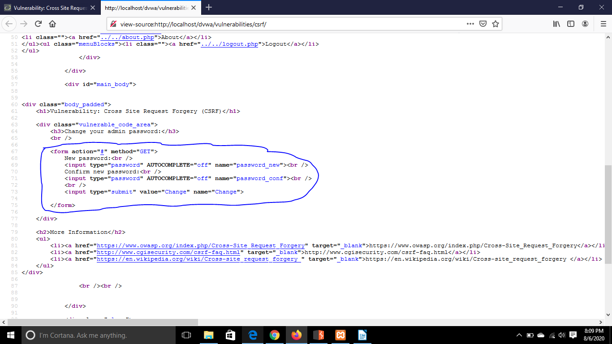
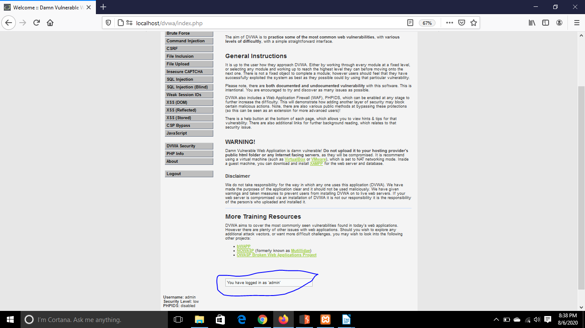

# DVWA Cross-Site Request Forgery (CSRF) Lab

## Overview

This lab documents a **Cross-Site Request Forgery (CSRF)** exercise performed against **Damn Vulnerable Web Application (DVWA)** in a controlled local environment.

The purpose of the exercise was to understand how a vulnerable web application can be manipulated into performing an authenticated action without adequately verifying that the request was intentionally initiated by the authenticated user.

The DVWA password-change functionality was used to demonstrate the vulnerability. The legitimate request was first inspected using **Burp Suite**, after which a crafted request was used to demonstrate how an authenticated user's password could be changed through CSRF.

All testing was performed against my own local DVWA installation for cybersecurity training.

---

## Objectives

The objectives of this lab were to:

* Configure a local DVWA testing environment.
* Set DVWA to the **Low** security level.
* Route browser traffic through Burp Suite.
* Understand how the DVWA password-change functionality works.
* Intercept and analyse a legitimate password-change request.
* Identify parameters required to perform the password change.
* Understand how an authenticated browser session can be abused in a CSRF attack.
* Construct a controlled CSRF proof of concept.
* Verify that the state-changing action was successfully performed.
* Understand how anti-CSRF controls protect web applications.

---

## Lab Environment

| Component  | Purpose                                                             |
| ---------- | ------------------------------------------------------------------- |
| DVWA       | Intentionally vulnerable web application used as the testing target |
| XAMPP      | Provides the local Apache web server and MySQL database             |
| Burp Suite | Used to intercept and inspect HTTP requests                         |
| Firefox    | Browser used to interact with DVWA                                  |
| Windows    | Host operating system                                               |
| Localhost  | Local isolated testing target                                       |

**DVWA Security Level:** Low

> **Scope:** All testing in this lab was performed against my own local DVWA environment for educational purposes.

---

# Vulnerability Background

**Cross-Site Request Forgery (CSRF)** is a web vulnerability in which an attacker causes an authenticated user's browser to send an unintended request to an application where the user is already authenticated.

The important concept is that the browser may automatically include authentication information, such as a session cookie, when sending the request.

A simplified attack flow is:

```text
Victim authenticates to application
            |
            v
Browser receives authenticated session
            |
            v
Victim encounters attacker-controlled request
            |
            v
Browser sends request to vulnerable application
            |
            v
Authentication information is included
            |
            v
Application accepts the request
            |
            v
Unintended action is performed
```

For a CSRF vulnerability to be useful, the targeted action generally needs to change application state, such as:

* Changing a password
* Changing an email address
* Updating account information
* Creating or deleting data
* Changing security settings
* Performing another privileged action

The application must therefore verify not only that a user is authenticated, but also that sensitive requests were legitimately initiated from the expected application workflow.

---

# Testing Procedure

## 1. Start the DVWA Environment

The required services for DVWA were started through XAMPP.

Apache provided the local web server and MySQL provided the database service used by DVWA.



Once the required services were running, the DVWA application could be accessed locally.

---

## 2. Access DVWA

The DVWA login page was opened through Firefox.


Authentication established a legitimate session with the application. This authenticated session was important for demonstrating CSRF because the attack relies on the browser already having authentication context for the target application.

---

## 3. Configure the DVWA Security Level

The DVWA security level was configured to **Low**.


DVWA intentionally provides reduced protections at this level so vulnerabilities such as CSRF can be observed in a controlled environment.

---

## 4. Configure Browser Traffic Through Burp Suite

Firefox was configured to route its HTTP traffic through **Burp Suite**.



This allowed requests generated by the browser to be intercepted and inspected before reaching DVWA.

Inspecting legitimate application traffic is useful because it reveals:

* The request method
* The target endpoint
* Parameter names
* Parameter values
* Authentication information
* How the application performs the requested action

---

## 5. Open the DVWA CSRF Module

The **CSRF** vulnerability module was opened within DVWA.

The page contained functionality allowing the authenticated user to change their password.



This represented a security-sensitive, state-changing operation suitable for demonstrating the impact of CSRF.

---

## 6. Intercept the Password-Change Request

A legitimate password change was submitted while Burp Suite interception was enabled.



The intercepted request revealed how DVWA submitted the password-change operation to the server.

The important observation was that the server accepted values supplied through the request while relying on the user's existing authenticated session.

Analysing a legitimate request provided the information necessary to understand how the same application action could potentially be reproduced outside the intended user interface.

---

## 7. Analyse the CSRF Request

The structure of the request was examined to identify the parameters required by the application.



At the Low security level, the application did not require a strong request-specific anti-CSRF mechanism before processing the password change.

This meant that a correctly constructed request could potentially cause the state-changing action to occur while the victim's browser supplied the authenticated session.

---

## 8. Construct a CSRF Proof of Concept

A controlled proof of concept was created to reproduce the required request.



The purpose of the proof of concept was to demonstrate that a request could be generated outside the normal DVWA password-change interface.

The important security concept is that the attack does **not** need to steal the user's password or session cookie directly.

Instead, it attempts to make the authenticated browser submit a valid-looking request on behalf of the user.

---

## 9. Execute the CSRF Proof of Concept

The proof of concept was executed while the browser still had an authenticated DVWA session.



The browser sent the crafted request to the vulnerable application.

Because the browser already had an authenticated relationship with DVWA, the request could be processed using the user's existing session.

This demonstrates why authentication alone does not prevent CSRF.

---

## 10. Verify the Password Change

The result was checked to determine whether the password-change action had been accepted.



The successful state change demonstrated that the application did not sufficiently verify that the sensitive request originated from the legitimate password-change workflow.

This confirmed the CSRF vulnerability within the intentionally vulnerable DVWA environment.

---

# Results

The exercise demonstrated how a state-changing application function can be vulnerable to **Cross-Site Request Forgery** when the server trusts an authenticated request without adequately verifying its origin or intent.

The testing workflow was:

```text
Authenticate to DVWA
        |
        v
Open Password Change Function
        |
        v
Intercept Legitimate Request
        |
        v
Identify Required Parameters
        |
        v
Construct CSRF Proof of Concept
        |
        v
Execute Request While Authenticated
        |
        v
Application Processes Request
        |
        v
Verify State Change
```

The key observation was that the application recognised the browser's authenticated session but did not sufficiently verify that the password-change request was intentionally initiated by the authenticated user through the legitimate application workflow.

---

# Why the Attack Worked

The attack worked because several conditions existed simultaneously.

## The User Was Authenticated

The browser already had an authenticated session with DVWA.

This meant requests sent to the application could automatically carry the authentication context required by the server.

## The Action Changed Application State

Changing a password modifies information associated with the user's account.

State-changing operations require stronger protection than ordinary requests that simply retrieve information.

## The Request Could Be Reproduced

The parameters necessary to perform the password change could be identified from the legitimate application request.

## Insufficient Anti-CSRF Protection

The application at the tested security level did not require a sufficiently strong, unpredictable, request-specific value proving that the request originated from the legitimate application workflow.

As a result, possession of an authenticated session was effectively treated as sufficient evidence that the request was legitimate.

---

# Authentication vs Request Intent

One of the most important lessons from this exercise is the difference between **authentication** and **request intent**.

Authentication answers:

> "Who is making this request?"

CSRF protection addresses another question:

> "Did this authenticated user intentionally initiate this sensitive action?"

A session cookie may prove that a request belongs to an authenticated session, but it does not necessarily prove that the user deliberately initiated the request.

This distinction is central to understanding CSRF.

---

# Security Impact

The impact of CSRF depends on what actions the vulnerable application allows an authenticated user to perform.

Potential consequences can include:

* Password changes
* Email address changes
* Modification of account settings
* Creation or deletion of application data
* Changes to security settings
* Administrative actions
* Financial or transactional actions
* Account takeover when sensitive identity information can be modified

A password-change CSRF vulnerability can be particularly serious because changing account credentials may allow an attacker to interfere with the legitimate user's access to the account.

The actual severity depends on the affected functionality and the privileges of the targeted user.

---

# Mitigation

CSRF should be addressed using multiple defensive controls.

## Anti-CSRF Tokens

Sensitive state-changing requests should contain an unpredictable token associated with the user's session.

A simplified legitimate request may conceptually contain:

```text
password=new_password
csrf_token=random_unpredictable_value
```

The server verifies the token before performing the action.

An external attacker should not be able to predict or obtain the correct token for the victim's authenticated session.

---

## SameSite Cookies

Session cookies can use the `SameSite` attribute to restrict when browsers include them in cross-site requests.

Common settings include:

```text
SameSite=Strict
SameSite=Lax
SameSite=None
```

`Strict` provides stronger cross-site restrictions, while `Lax` allows some cross-site navigation scenarios.

`SameSite=None` permits cross-site cookie usage and requires the cookie to also use the `Secure` attribute in modern browsers.

The appropriate setting depends on the application's legitimate cross-site requirements.

---

## Validate Origin Information

Applications can inspect HTTP headers such as:

```text
Origin
Referer
```

to help determine whether sensitive requests originated from an expected source.

This can provide an additional defence, although it should generally complement rather than replace robust anti-CSRF protections.

---

## Avoid State Changes Through GET Requests

Operations that modify application state should not be designed as simple GET requests.

GET should generally be used for retrieving resources rather than performing sensitive modifications.

State-changing operations should use appropriate methods such as POST together with proper CSRF protection.

---

## Re-Authentication for Sensitive Operations

Highly sensitive actions can require the user to confirm their identity again.

Examples include:

* Changing a password
* Changing MFA settings
* Modifying recovery information
* Performing highly privileged administrative operations

Re-authentication can reduce the impact of an existing authenticated session being abused.

---

## Secure Cookie Configuration

Authentication cookies should use appropriate security attributes, including:

```text
Secure
HttpOnly
SameSite
```

These attributes address different threats and should form part of a broader secure session-management strategy.

---

# What I Learned

This lab helped me understand that a valid authenticated session does not automatically mean every request associated with that session was intentionally initiated by the user.

Through this exercise, I gained practical experience with:

* Understanding the basic mechanics of CSRF.
* Identifying state-changing application functionality.
* Intercepting legitimate HTTP requests using Burp Suite.
* Examining request parameters.
* Understanding how authenticated browser sessions affect requests.
* Reproducing application behaviour through a controlled proof of concept.
* Understanding the difference between authentication and request intent.
* Recognising why sensitive operations require anti-CSRF protection.
* Understanding the role of anti-CSRF tokens.
* Understanding the purpose of SameSite cookies.
* Recognising the value of Origin and Referer validation.
* Understanding why sensitive state changes should not rely solely on authentication cookies.

The most important lesson was that **CSRF abuses the trust an application places in an authenticated browser**.

The attacker does not necessarily need to know the victim's authentication credentials. Instead, the attack attempts to cause the victim's browser to perform an action while the browser already possesses the authentication context required by the application.

---

# Key Takeaways

* CSRF targets authenticated application actions.
* Authentication does not prove that a user intentionally initiated a specific request.
* Browsers may automatically include authentication cookies with requests.
* State-changing operations require additional protection.
* Anti-CSRF tokens are a major defence against CSRF.
* SameSite cookies can reduce cross-site request risk.
* Origin and Referer validation can provide additional protection.
* Sensitive operations may benefit from re-authentication.
* Secure session management and CSRF protection should be implemented together.

---

# Ethical Use Disclaimer

This lab was performed using **Damn Vulnerable Web Application (DVWA)**, an intentionally vulnerable application designed for cybersecurity education and security testing practice.

All testing documented in this repository was conducted in a controlled local environment against a system intended for this purpose.

The techniques demonstrated in this repository should only be used against systems that you own or systems for which you have explicit authorisation to perform security testing.

---

## Navigation

[← Previous: Command Injection](../02-command-injection/README.md) | [Back to Repository Home](../../README.md) | [Next: SQL Injection →](../04-sql-injection/README.md)
